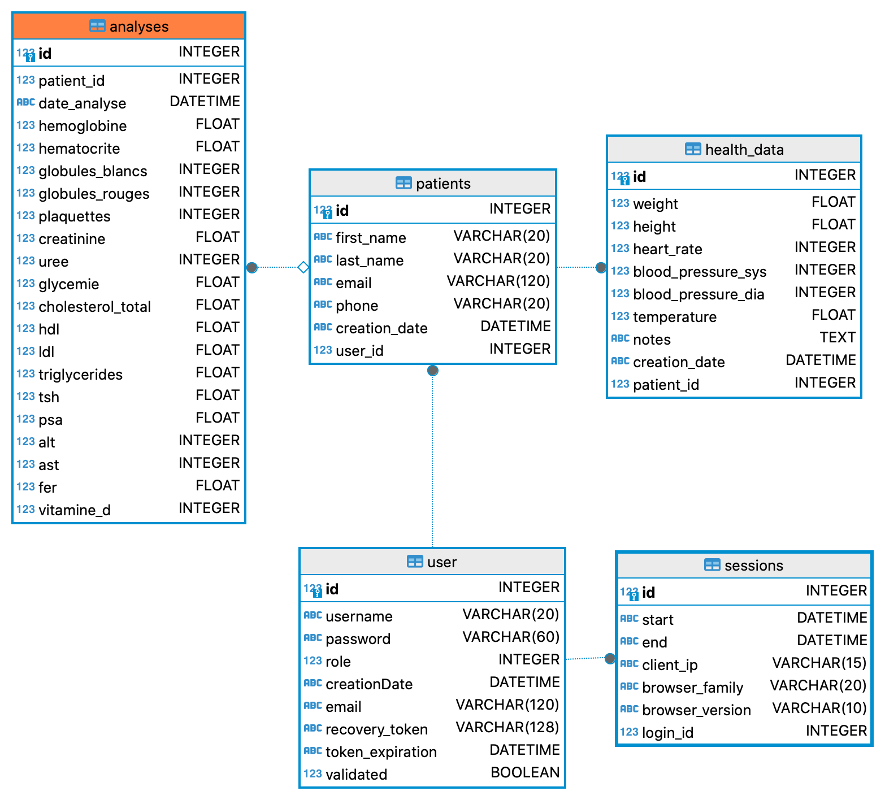

### Gestion des patients d'un cabinet médical

    Outil d'aide pour médecins non informatisés pour historiser leurs consultations, et les données de leurs patients

## Fonctionnalités actuelles

### Gestion cabinet médical:
    [x] Procédure d'enregistrement du cabinet médical (création compte sur le site, validation par mail)
    [x] Fiche de réinitialisation de mot de passe perdu
    [x] Fiche de modification de mot de passe
    [x] Consultation liste patients

### Gestion patient:

    [x] Fiche saisie nouveau patient
    [ ] Fiche de mise à jour patient
    [x] Consultation de l'historique des visites médicales:
        [x] Possibilité d'envoyer une sélection par mail au patient
    [x] Consultation de l'historique des analyses sanguines:
        [x] Possibilité d'envoyer une sélection par mail au patient
    [x] Affichage graphique données de santé d'un patient
        [x] Impression graphique
        [x] Envoi par mail au patient

### Gestion visites médicales:

    [x] Fiche saisie nouvelle visite patient
    [ ] Fiche de mise à jour visite patient

### Gestion analyses sanguines:

    [x] Fiche saisie nouvelle analyse sanguine
    [ ] Fiche de mise à jour analyse sanguine

### Administration du site (Rôle Admin):

    [x] Historique des sessions utilisateur (heure début, heure fin, adresse IP, logiciel client)
    [x] Gestion des utilisateurs inscrits dans l'application (modification rôle ou suppression)

https://healthcare06.pythonanywhere.com/

https://help.pythonanywhere.com/pages/VirtualEnvForWebsites